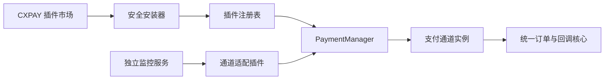
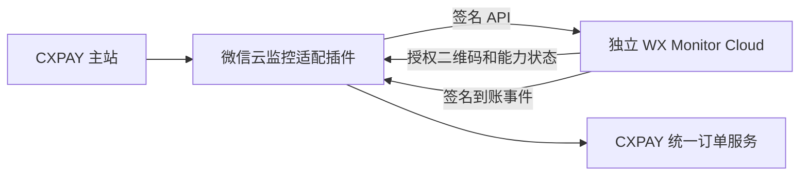

# CXPAY 支付通道插件化设计

## 1. 目标与结论

CXPAY 的核心目标是支持支付宝、微信、QQ 个人收款码收款与到账监控，不接入官方商家支付。现有通道可以并且适合拆成独立插件，由管理员在主站选择安装、启用、停用、升级和卸载。

当前 `PaymentManager` 已能扫描支付驱动，并通过统一接口识别支付和监控能力；Webman 也具备基础插件装载能力。但“发现 Driver”还不是完整插件系统，仍需补齐插件清单、注册表、签名校验、版本兼容、数据迁移、安装事务、回滚和安全重载。

当前插件市场的远程安装接口返回 501 是合理的安全保护。在可信仓库和安装包签名完成前，不应直接下载、解压和执行远程 PHP 插件。

## 2. 架构边界



CXPAY 核心保留：

- 订单创建、金额匹配、状态机和幂等；
- 商户异步通知与人工复核；
- 插件接口、注册表和生命周期管理；
- 密钥加密、审计、权限和任务调度；
- 插件市场与通道配置页面。

插件负责具体支付渠道能力，例如支付宝 APP 监听、支付宝扫码账单、微信小账本、微信收款单云监控、QQ APP 监听和 QQ 云监控。

支付宝扫码免挂使用独立插件 `cxpay.alipay.scan_monitor`。插件在展示个人收款码前必须向授权云账单服务登记平台订单，到账后只接受带稳定账单号、平台订单号、发生时间、推送时间、随机数和 HMAC-SHA256 签名的回调。旧内置 `alipay_scan_bill` 仅使用共享 Token，缺少订单登记和防重放能力；为避免破坏存量订单仍保留运行兼容，但管理接口禁止再新建该类型通道。

## 3. 插件包规范

建议复用 Webman 的 `plugin/` 目录，但制定 CXPAY 支付插件规范。安装时不要修改 `app/payment/Drivers`。

```text
plugin/cxpay/wxpay_cloud/
├── manifest.json
├── signature.json
├── src/
│   ├── Driver.php
│   ├── ProviderClient.php
│   └── CapabilityDetector.php
├── config/
│   └── schema.json
├── routes/
│   └── admin.php
├── migrations/
├── resources/views/
└── tests/
```

安装包可使用 `.cxpay-plugin` 扩展名，本质为签名 ZIP。包内不得包含安装阶段自动运行的 Composer、Shell、PowerShell 或其他系统命令。

`manifest.json` 示例：

```json
{
  "schema": 1,
  "id": "cxpay.wxpay.cloud",
  "name": "微信云端监控",
  "version": "1.0.0",
  "publisher": "cxpay.official",
  "payment_type": "wxpay",
  "collection_mode": "personal_qr",
  "monitor_mode": "callback",
  "entry": "plugin\\cxpay\\wxpay_cloud\\src\\Driver",
  "requires": {
    "cxpay": ">=1.0.0 <2.0.0",
    "php": ">=8.1",
    "extensions": ["json", "openssl"]
  },
  "capabilities": {
    "dynamic_qr": true,
    "server_monitor": true,
    "account_capability_detection": true
  },
  "permissions": {
    "outbound_domains": ["monitor.example.com"],
    "callbacks": ["/api/plugin/wxpay-cloud/event"],
    "scheduled_tasks": true,
    "secret_config": ["client_secret", "callback_secret"]
  },
  "config_schema": "config/schema.json"
}
```

`id` 是稳定身份，不能随版本变化。支付通道实例应引用 `plugin_id + driver_code`，不能只引用目录名。

## 4. 接口设计

保留现有 `PaymentDriverInterface` 和 `MonitorableDriverInterface`，增加插件生命周期接口：

```php
interface PaymentPluginInterface
{
    public function manifest(): array;
    public function install(PluginContext $context): void;
    public function upgrade(PluginContext $context, string $fromVersion): void;
    public function enable(PluginContext $context): void;
    public function disable(PluginContext $context): void;
    public function healthCheck(PluginContext $context): PluginHealthResult;
}
```

为微信扫码后的收款单能力判断增加统一接口：

```php
interface AccountCapabilityDetectorInterface
{
    public function detect(AccountContext $account): AccountCapabilities;
}
```

它应区分“已开通收款单”“明确未开通”“需要重新授权”“暂时无法判断”。只有明确未开通时，主站才提示用户只能使用小账本；网络超时和服务异常不能误判为未开通。

插件只能生成标准化到账事件，最终支付成功必须由 CXPAY 核心订单服务完成，插件不能绕过核心状态机直接修改订单。

## 5. 注册表与数据

建议增加：

### `cx_plugin`

- `plugin_id`、`name`、`version`、`publisher`；
- `status`：installed、enabled、disabled、broken；
- `signature_status`、`manifest_json`；
- `installed_at`、`enabled_at`、`updated_at`；
- `last_health_status`、`last_health_message`。

### `cx_plugin_migration`

- `plugin_id`、`migration`、`plugin_version`；
- `batch`、`executed_at`。

支付通道表增加 `plugin_id` 和 `driver_code`。历史订单保存插件与通道快照，避免升级后无法解释旧订单来源。

## 6. 安装流程

安装和启用必须分离，安装完成后默认停用：

1. 管理员从可信仓库选择插件，或上传离线包；
2. 下载到专用临时目录，不直接进入运行目录；
3. 校验仓库索引签名、包内逐文件 SHA-256 和发布者签名；首期实现采用 OpenSSL RSA-SHA256，后续可增加 Ed25519；
4. 拒绝路径穿越、绝对路径、符号链接、超大文件和禁止类型；
5. 校验 CXPAY、PHP、扩展和插件依赖版本；
6. 展示外联域名、回调、定时任务、敏感配置和迁移范围；
7. 解压到版本化暂存目录并执行静态检查；
8. 记录并执行迁移，运行健康检查；
9. 原子切换当前版本，更新注册表；
10. 重建路由和进程配置，受控重启 Webman Worker；
11. 管理员配置完成后手动启用。

任何步骤失败都必须恢复到安装前状态。升级时保留上一版本目录和迁移批次，支持回滚。

## 7. 启停、升级与卸载

### 启用

- 签名、依赖和健康检查通过；
- 必填配置完整；
- 回调插件通过连通性测试；
- 启用后才注册到 `PaymentManager`，并出现在创建通道页面。

### 停用

- 先停止创建新订单；
- 排空或人工处理未完成订单；
- 停止插件任务和事件消费；
- 保留配置、日志和历史订单。

### 升级

- 显示更新说明和新增权限；
- 处理订单期间先进入排空状态；
- 代码切换和迁移必须有失败回滚策略；
- 禁止在 Web 请求中运行不受控依赖安装。

### 卸载

- 必须先停用；
- 存在未完成订单时拒绝卸载；
- 默认只删除插件代码和运行注册，不删除历史订单、审计记录或业务数据；
- 删除插件数据必须单独二次确认。

## 8. 主站插件市场

管理端建议提供：

- 可安装：可信仓库中的插件；
- 已安装：当前版本、启停状态和健康状态；
- 可更新：变更日志、兼容性和新增权限；
- 本地安装：上传官方签名离线包；
- 信任管理：可信发布者及公钥，仅超级管理员可修改。

详情页必须展示：

- 支持的支付类型与监控方式；
- 是否需要手机常驻、电脑常驻或独立云服务；
- 是否仅支持个人收款码；
- 外部依赖、数据流向、权限和风险等级；
- CXPAY 与 PHP 兼容范围。

只有“已安装且已启用”的插件才显示在支付通道选择列表中。

## 9. 微信云监控插件的特殊边界

微信云端免挂机推荐交付为“主站适配插件 + 独立 WX Monitor Cloud”，不要把账号会话、协议状态机或浏览器自动化直接塞入 CXPAY Worker。



适配插件负责扫码授权入口、服务调用、收款单/小账本能力显示、事件验签和标准化。独立服务负责微信会话、账号调度、断线重连和账单采集。

PHP 插件与主站处于同一权限域，不能形成真正的代码沙箱。因此第三方高风险协议实现应优先作为独立服务部署，主站插件仅作为受限 API 适配器。

## 10. 推荐落地顺序

### 第一阶段：本地可信插件

- 实现清单、注册表、安装生命周期和健康检查；
- 将现有个人收款驱动迁移成内置官方插件；
- 支持后台上传官方签名离线包；
- 暂不开放第三方远程仓库。

### 第二阶段：官方插件仓库

- 建设签名仓库索引；
- 支持在线安装、更新检查和版本回滚；
- 增加权限变更确认、发布者信任和吊销机制。

### 第三阶段：第三方生态

- 发布插件 SDK、测试套件和审核规范；
- 执行人工审核与自动化安全扫描；
- 协议型监控优先限制为外部服务适配插件；
- 提供紧急停用和恶意版本吊销机制。

## 11. 最终建议

首期只允许安装 CXPAY 官方签名插件。先完成“离线包安装 + 启停 + 健康检查 + 回滚”，验证稳定后再接官方在线仓库。

这样既能让管理员在主站自由选择支付宝、微信和 QQ 的个人收款通道，也能把故障和迭代隔离在单个插件内；对于微信云监控等高风险、长连接方案，则通过独立服务隔离账号会话和资源消耗。

## 12. 第一阶段实现状态

当前主站已经具备：

- 严格的个人收款插件清单校验；
- 带文件锁和原子替换的运行时插件注册表；
- `.cxpay-plugin` 本地安装入口；
- RSA-SHA256 发布者验签和包内逐文件 SHA-256 校验；
- 路径穿越、绝对路径、重复文件、超限文件、`vendor/` 和禁止扩展名拦截；
- 版本化安装目录以及安装后默认停用；
- 后台插件安装、启用和停用界面；
- 停用前检查仍在使用的支付通道；
- 插件驱动与内置驱动标识冲突保护；
- 远程插件仓库继续关闭。

可信发布者公钥放在 `config/plugin_keys/{publisher}.pem`。私钥只能保存在发布系统或离线签名环境，不能上传或存放在 CXPAY 主站。

官方插件离线构建命令：

```bash
php tools/plugin/build.php /path/to/plugin-source /secure/path/private.pem dist/wxpay-cloud.cxpay-plugin
```

如果私钥有口令，通过构建环境的 `CXPAY_PLUGIN_KEY_PASSPHRASE` 变量提供。不要把私钥、口令或未脱敏的账号配置写入插件包。

第二阶段已增加：

- 多版本保留与停用状态下的安全回滚；
- 插件卸载及支付通道引用保护；
- 最近 100 条安装、升级、启停和回滚操作记录；
- 微信云监控适配器插件源码；
- 统一账号能力探测接口；
- 商户通道“检测收款能力”入口；
- 只有 `RECEIPT_NOT_OPENED` 才提示只能使用小账本的判断规则。

后续仍需实现数据库迁移执行日志、Worker 受控重载、官方仓库签名索引、发布者吊销列表，以及真实微信授权/账单采集器。当前微信适配插件不会伪造扫码授权或能力探测结果。

独立 WX Monitor Cloud 已实现 SQLite 单节点和 MySQL 多 Worker 两种运行模式，代码位于 `services/wx-monitor-cloud`。主站插件在订单出码前登记订单，采集器上报真实账单后由云服务完成唯一匹配，再通过发件箱向 CXPAY 签名回调。具体微信采集器、跨节点高可用编排和运维后台仍属于后续工作。

云监控插件还提供异常账单复核能力。CXPAY 管理后台通过插件签名请求拉取 `REVIEW_REQUIRED`/`UNMATCHED` 事件；管理员选择候选订单后，由云服务再次执行账号、金额、状态和到账时间窗校验。成功结果进入同一回调发件箱，主站仍只通过统一订单结算服务完成入账。

云服务密钥采用版本化存储。请求密钥允许新旧密钥在有限宽限期内并存；响应及回调密钥支持延迟生效，插件通过 `callback_secret` 与 `callback_secret_previous` 双密钥完成无中断切换。已吊销或超过有效期的密钥不会回退到旧版 `principals` 字段。

插件 1.3.0 将云服务运维状态接入 CXPAY 后台，展示当前通道账号能力、关联采集器最近合法鉴权时间、异常账单数量和回调队列积压。指标由云端按 Client 隔离聚合，不向主站返回密钥、密文或其他租户账号。
