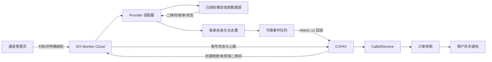

# CXPAY 微信个人收款云端监控服务设计方案

> 插件安装、启停和升级方式见 [CXPAY 支付通道插件化设计](./PAYMENT_PLUGIN_ARCHITECTURE.md)。推荐交付形式为“主站适配插件 + 独立云监控服务”。

> 文档状态：第一版设计稿  
> 适用项目：CXPAY  
> 目标范围：微信个人收款码、小账本、收款单到账监控；不接入微信官方商户支付  
> 核心原则：授权使用、凭据隔离、账单幂等、可替换采集器、失败时停止接单

> 实现状态：独立服务 MVP 已位于 `services/wx-monitor-cloud`，主站适配插件源码位于 `plugins-src/wxpay-cloud-adapter`。当前已完成签名 API、授权会话、能力探测、订单登记、账单唯一匹配和可靠回调；具体微信授权/账单采集器仍需对接合法数据来源，系统不会生成虚假二维码或授权结果。

> 授权采集器 SDK 位于 `agents/wx-collector`，包含签名云端客户端、原子任务领取、可靠账单确认游标和标准签名 HTTPS 服务商适配器。默认适配器为不可用状态。

## 1. 背景与目标

CXPAY 当前已经具备个人收款码展示、金额浮动、监控助手安全上报、账单幂等、订单匹配、人工复核和商户异步通知能力。缺失的是一个可独立运行的微信云端采集服务，用于维护经用户明确授权的微信收款会话，并将小账本或收款单到账信息转换为 CXPAY 能处理的标准事件。

本方案建设两个边界清晰的组件：

1. **CXPAY 核心网关**：负责商户、通道、订单、金额占位、账单核销和下游通知。
2. **微信云端监控服务（WX Monitor Cloud）**：负责账号授权会话、采集器调度、二维码获取、账单查询、标准化和可靠推送。

首期目标：

- 支持一个 CXPAY 实例接入一个独立监控服务。
- 支持一个监控服务管理多个已授权微信收款账号。
- 首期优先实现“小账本账单列表”采集模型。
- 预留“收款单按订单创建二维码、按 `receipt_id` 查询”模型。
- 采集器不可用、登录态失效或账单延迟超限时，自动将关联通道置为离线并停止接单。
- 账单至少一次投递，CXPAY 依靠业务幂等做到只核销一次。

非目标：

- 不申请或接入微信支付商户号。
- 不接管资金、不代收、不二次清算。
- 不提供绕过登录验证、验证码、风控或未授权获取账号数据的功能。
- 不把任何特定非公开协议直接写进 CXPAY 核心代码。

## 2. 总体架构



推荐独立部署 WX Monitor Cloud，禁止与 CXPAY 共用数据库、Redis 和应用密钥。两者只通过 HTTPS API 通信。

## 3. 组件职责

### 3.1 CXPAY

- 创建订单并选择 `wxpay_protocol_cloud` 通道。
- 小账本模式继续使用金额浮动，保证同一通道有效期内实付金额唯一。
- 收款单模式请求监控服务创建指定金额收款单，保存返回的 `receipt_id`。
- 接收账号心跳、账单事件和异步出码结果。
- 验证 HMAC、时间戳、Nonce、服务身份和通道绑定。
- 调用现有 `CallbillService` 完成幂等入库、自动匹配或人工复核。
- 监控服务异常时将通道标记为离线，订单路由不再选择该通道。

### 3.2 WX Monitor Cloud

- 创建、轮询、确认管理员发起的账号授权会话。
- 将敏感会话凭据加密保存，不向 CXPAY 返回原始凭据。
- 通过 Provider 获取二维码、查询账单和检查账号状态。
- 将不同 Provider 的结果标准化为统一账单模型。
- 使用来源交易编号生成稳定的 `source_bill_id`。
- 将账单写入本地 Outbox，再可靠推送 CXPAY。
- 管理登录态生命周期、退避、限流、熔断和重新授权。

### 3.3 Provider 适配器

Provider 是唯一允许理解具体数据源协议的模块。核心服务只依赖以下契约：

```php
interface WechatCollectionProviderInterface
{
    public function createAuthorizationSession(array $context): AuthorizationSession;
    public function pollAuthorization(string $providerSessionId): AuthorizationStatus;
    public function confirmAuthorization(string $providerSessionId): AuthorizedAccount;
    public function refreshSession(AuthorizedAccount $account): SessionStatus;
    public function getAccountStatus(AuthorizedAccount $account): AccountStatus;
    public function getBookQrCode(AuthorizedAccount $account): QrCodeResult;
    public function listBookBills(AuthorizedAccount $account, BillCursor $cursor): BillPage;
    public function createReceipt(AuthorizedAccount $account, ReceiptRequest $request): ReceiptResult;
    public function queryReceipt(AuthorizedAccount $account, string $receiptId): ReceiptStatus;
    public function closeReceipt(AuthorizedAccount $account, string $receiptId): void;
}
```

允许的 Provider 类型：

- `mock`：本地开发和自动化测试，不连接真实账号。
- `authorized_api`：接入有明确授权和接口文档的账单服务。
- `device_agent`：由用户自有实体设备采集通知或账单，再连接云服务。
- 其他 Provider 必须经过单独安全和合规评审。

任何 Provider 失败都不能绕过授权流程，也不能通过伪造成功结果让订单核销。

## 4. 工作模式

### 4.1 扫码授权后的能力探测

管理员完成微信扫码授权后，WX Monitor Cloud 必须先执行只读能力探测，再决定账号可以启用的模式。探测结果采用显式状态，禁止使用简单布尔值：

```text
UNKNOWN
  -> CHECKING
  -> RECEIPT_AVAILABLE
  -> RECEIPT_NOT_OPENED
  -> REAUTH_REQUIRED
  -> TEMPORARY_ERROR
```

推荐流程：

1. 完成基础微信账号授权，得到监控服务内部 `account_id`。
2. 验证小账本会话和只读账单接口；成功后记录 `book.available=true`。
3. 尝试取得收款单模式的授权会话引用。
4. 调用收款单账号信息或收款单列表等只读接口，禁止创建测试收款单。
5. 根据结构化错误码映射能力状态，不依赖单一中文错误文案。
6. 将探测结果、证据摘要、Provider 版本和检测时间保存到账号能力快照。
7. 把可用模式返回 CXPAY，前端根据状态引导用户选择。

能力判断规则：

- `RECEIPT_AVAILABLE`：成功取得收款单账号标识，并且只读列表/账号接口明确返回成功。
- `RECEIPT_NOT_OPENED`：Provider 返回经过适配器确认的“账号未开通收款单”业务错误。
- `REAUTH_REQUIRED`：登录态、授权 Code 或 SID 已失效，提示重新扫码，不能提示未开通。
- `TEMPORARY_ERROR`：网络、限流、服务异常或未知响应，保留当前配置并允许稍后重试，不能自动降级。
- `UNKNOWN`：Provider 不具备可靠的能力探测接口，禁止启用收款单模式。

授权结果示例：

```json
{
  "account_id": "wacct_01...",
  "status": "ACTIVE",
  "capabilities": {
    "book": {
      "available": true,
      "checked_at": 1785200000
    },
    "receipt": {
      "status": "RECEIPT_NOT_OPENED",
      "checked_at": 1785200000,
      "retryable": false
    }
  },
  "recommended_mode": "book"
}
```

CXPAY 页面提示规则：

- 收款单可用：展示“小账本”和“收款单”两个选项，默认推荐收款单。
- 明确未开通：提示“当前微信账号未开通收款单功能，只能使用小账本模式”，隐藏收款单启用按钮。
- 需要重新授权：提示重新扫码，不创建通道。
- 临时检测失败：提示稍后重试，允许保存为未启用状态，禁止误导用户只能使用小账本。
- 小账本也不可用：拒绝创建云监控通道。

能力结果不是永久状态。账号重新授权、Provider 版本变化、用户主动刷新或距离上次检测超过 24 小时时，应重新探测。运行期间若收款单接口明确返回“功能已关闭”，立即停止创建新收款单，将通道置为降级状态，并在管理员确认后切换到小账本，禁止静默切换正在使用的订单匹配方式。

### 4.2 小账本模式（第一阶段）

1. 管理员在 CXPAY 创建微信云监控通道。
2. CXPAY 请求 WX Monitor Cloud 创建授权会话。
3. 管理员完成扫码和确认，监控服务保存授权账号引用。
4. 监控服务取得并缓存个人收款二维码，CXPAY 只保存可展示的二维码内容或短期资源标识。
5. CXPAY 下单时分配唯一实付金额并展示二维码。
6. 监控服务按游标拉取账单列表，将新到账转换成标准事件。
7. CXPAY 按通道、实付金额和账单发生时间匹配订单。

小账本模式不得使用“余额差”作为正常账单来源。Provider 必须返回可稳定去重的交易编号；只有金额和余额差的数据源只能作为实验性降级源，且全部进入人工复核。

### 4.3 收款单模式（第二阶段）

1. CXPAY 创建平台订单后调用监控服务创建指定金额收款单。
2. 监控服务返回 `receipt_id`、二维码内容和过期时间。
3. CXPAY 将 `receipt_id` 绑定到订单并展示二维码。
4. 监控服务查询待支付收款单状态。
5. 支付成功后以 `receipt_id` 精确定位 CXPAY 订单。
6. 核销成功后异步关闭收款单；关闭失败进入补偿队列，不回滚已确认的支付结果。

收款单模式不依赖金额浮动，但必须保证一个 `receipt_id` 只绑定一笔 CXPAY 订单。

## 5. 关键状态机

### 5.1 授权账号状态

```text
NEW
  -> AUTH_PENDING
  -> ACTIVE
  -> DEGRADED
  -> REAUTH_REQUIRED
  -> DISABLED
```

- `AUTH_PENDING`：等待扫码或用户确认。
- `ACTIVE`：账号状态正常，账单延迟在阈值内。
- `DEGRADED`：暂时请求失败，短时间退避重试，不创建新的收款单。
- `REAUTH_REQUIRED`：会话失效，关联通道立即离线。
- `DISABLED`：管理员主动解绑或安全策略封禁。

### 5.2 账单事件状态

```text
DISCOVERED -> NORMALIZED -> OUTBOX_PENDING -> DELIVERED
                                  |              |
                                  v              v
                           RETRY_WAIT       ACKNOWLEDGED
                                  |
                                  v
                           DEAD_LETTER
```

不能在成功写入 Outbox 前推进采集游标，否则进程崩溃可能永久丢单。

## 6. API 设计

所有接口必须使用 HTTPS。服务间认证使用 `client_id + HMAC-SHA256`，签名原文包含：

```text
version|method|path|body_sha256|timestamp|nonce|client_id
```

时间容差建议 300 秒，Nonce 在 Redis 中保存至少 600 秒。密钥至少 32 字节，支持双密钥轮换。

### 6.1 CXPAY 调用监控服务

#### 创建授权会话

```http
POST /v1/authorizations
```

请求：

```json
{
  "cxpay_channel_id": 12,
  "mode": "book",
  "callback_base_url": "https://pay.example.com"
}
```

响应：

```json
{
  "authorization_id": "wauth_01...",
  "status": "AUTH_PENDING",
  "qr_image": "data:image/png;base64,...",
  "expires_at": 1785200300
}
```

#### 查询授权状态

```http
GET /v1/authorizations/{authorization_id}
```

授权确认完成后的响应必须包含账号能力快照。管理员也可以主动重新检测：

```http
POST /v1/accounts/{account_id}/capabilities/refresh
GET  /v1/accounts/{account_id}/capabilities
```

#### 获取账号状态和二维码

```http
GET /v1/accounts/{account_id}
GET /v1/accounts/{account_id}/qrcode
```

#### 创建及查询收款单

```http
POST /v1/accounts/{account_id}/receipts
GET  /v1/accounts/{account_id}/receipts/{receipt_id}
POST /v1/accounts/{account_id}/receipts/{receipt_id}/close
```

创建请求必须携带 CXPAY 平台订单号作为幂等键：

```json
{
  "idempotency_key": "CX202607290001",
  "amount": "10.00",
  "remark": "CX00001",
  "expires_at": 1785200300
}
```

### 6.2 监控服务回调 CXPAY

#### 账号心跳

```http
POST /api/wxcloud/events
```

```json
{
  "version": "1",
  "event_id": "evt_01...",
  "event_type": "account.heartbeat",
  "channel_id": 12,
  "account_id": "wacct_01...",
  "status": "ACTIVE",
  "observed_at": 1785200000,
  "timestamp": 1785200005,
  "nonce": "..."
}
```

#### 到账事件

```json
{
  "version": "1",
  "event_id": "evt_01...",
  "event_type": "bill.received",
  "channel_id": 12,
  "account_id": "wacct_01...",
  "pay_type": "wxpay",
  "source_bill_id": "wxbook:transaction-id",
  "receipt_id": "",
  "money": "10.03",
  "occurred_at": 1785200000,
  "remark": "",
  "timestamp": 1785200005,
  "nonce": "..."
}
```

CXPAY 返回：

```json
{
  "code": 1,
  "ack_event_id": "evt_01...",
  "duplicate": false,
  "matched_trade_no": "CX202607290001"
}
```

返回非 2xx、超时或响应 `ack_event_id` 不一致时，监控服务必须重试。重复事件应返回成功和 `duplicate=true`，避免无意义重试。

## 7. 数据模型

### 7.1 WX Monitor Cloud 数据表

#### `wx_client`

- `id`
- `client_id`（唯一）
- `secret_ciphertext`
- `allowed_callback_hosts`
- `status`
- `created_at`、`updated_at`

#### `wx_authorization_session`

- `id`
- `client_id`
- `cxpay_channel_id`
- `provider`
- `provider_session_id_ciphertext`
- `status`
- `qr_payload_ciphertext`
- `expires_at`
- `created_at`、`confirmed_at`

#### `wx_account`

- `id`
- `client_id`
- `provider`
- `provider_account_ref_ciphertext`
- `credential_ciphertext`
- `credential_key_version`
- `mode`（`book`/`receipt`）
- `capabilities`（结构化 JSON，不包含敏感响应原文）
- `capability_checked_at`
- `provider_version_at_check`
- `display_name_masked`
- `status`
- `last_success_at`
- `last_bill_at`
- `next_poll_at`
- `failure_count`
- `created_at`、`updated_at`

#### `wx_channel_binding`

- `id`
- `client_id`
- `cxpay_channel_id`（唯一）
- `account_id`
- `callback_url`
- `callback_secret_version`
- `status`
- `created_at`、`updated_at`

#### `wx_bill`

- `id`
- `account_id`
- `source_bill_id`
- `money`
- `occurred_at`
- `remark`
- `raw_payload_ciphertext`
- `payload_hash`
- `created_at`

唯一索引：`(account_id, source_bill_id)`。

#### `wx_receipt`

- `id`
- `account_id`
- `cxpay_trade_no`
- `idempotency_key`
- `provider_receipt_id`
- `money`
- `qr_payload_ciphertext`
- `status`
- `expires_at`
- `created_at`、`paid_at`、`closed_at`

唯一索引：`idempotency_key`、`provider_receipt_id`。

#### `wx_outbox_event`

- `id`
- `event_id`（唯一）
- `binding_id`
- `event_type`
- `payload`
- `status`
- `attempts`
- `next_attempt_at`
- `last_error`
- `created_at`、`delivered_at`

### 7.2 CXPAY 数据调整

建议新增：

1. `cx_order.provider_ref`：保存 `receipt_id` 等精确匹配标识。
2. `cx_order.provider_account_id`：记录订单使用的监控账号。
3. `cx_pay_channel.monitor_account_id`：非敏感的监控账号引用。
4. `cx_pay_channel.monitor_status_reason`：通道离线原因。
5. `cx_pay_channel.last_bill_time`：最后发现真实到账的时间。
6. `cx_cloud_event`：保存 `event_id`、事件类型、摘要和处理结果，建立唯一索引防止事件重复处理。

不建议把 WX Monitor Cloud 原始凭据塞进现有 `cx_pay_channel.config`。

## 8. 与现有 CXPAY 代码的集成

### 8.1 驱动调整

将 `WxpayProtocolCloud\Driver` 从简单共享 Token 回调改造成监控服务客户端：

- `monitorMode()` 保持 `callback`，账单由独立服务推送。
- `pay()`：小账本返回缓存二维码；收款单模式调用客户端创建收款单。
- `notify()`：不再直接处理任意 GET/POST Token，改由专用控制器验签并标准化。
- `query()`：收款单模式可查询 `receipt_id`；小账本模式仍由到账事件推进状态。
- `upchannel()`：验证监控服务、账号绑定、模式和连接状态。

### 8.2 新增服务类

```text
app/service/WxCloudClient.php
app/service/WxCloudEventService.php
app/controller/api/WxCloudController.php
support/WxCloudProtocol.php
```

- `WxCloudClient`：请求独立监控服务，处理超时、签名和响应校验。
- `WxCloudEventService`：验证事件幂等，转换为 `CallbillService::processPush()` 调用。
- `WxCloudController`：提供授权会话、状态查询和事件接收 API。
- `WxCloudProtocol`：生成规范签名原文，禁止不同客户端自行拼接字段。

### 8.3 复用 CallbillService

到账事件转换参数：

```php
$callbillService->processPush(
    'wxpay_protocol_cloud',
    'WXCLOUD:' . $accountId,
    (float) $money,
    $remark,
    $channelId,
    $sourceBillId,
    $occurredAt,
    hash('sha256', $canonicalPayload),
    $collectorVersion
);
```

收款单模式优先按 `provider_ref=receipt_id` 精确匹配；只有小账本模式才使用金额和时间窗口匹配。

### 8.4 通道在线判断

`callback` 模式目前不要求心跳，但云监控通道仍需要服务级心跳。建议扩展能力接口或新增通道健康策略：

```text
none       不检测
device     监控助手心跳
provider   外部监控服务账号心跳
server     本地服务端轮询结果
```

当满足任一条件时立即离线：

- 账号状态为 `REAUTH_REQUIRED` 或 `DISABLED`。
- 连续失败达到阈值，例如 5 次。
- 最后成功采集时间超过 180 秒。
- 监控服务签名、TLS 身份或绑定关系验证失败。
- Provider 明确返回限流或风控状态，需要人工处理。

## 9. 调度、并发与可靠性

- 按账号分布式加锁，同一账号同时只能有一个采集任务。
- 默认轮询间隔根据数据源能力配置，不写死在驱动中。
- 成功无新账单时正常推进游标；响应异常时不推进游标。
- 使用指数退避并加随机抖动，禁止固定高频请求。
- 账号之间设置全局速率限制，避免故障时形成请求风暴。
- 账单写库与 Outbox 写入使用同一数据库事务。
- 推送采用至少一次语义；消费端根据 `event_id` 和 `source_bill_id` 双重幂等。
- 死信事件进入后台告警和人工重放，不允许静默丢弃。
- 监控服务重启后从持久化游标恢复，禁止只把游标放在内存或 Redis。

## 10. 安全设计

### 10.1 凭据保护

- 会话凭据使用信封加密：数据密钥加密凭据，主密钥只存在于 KMS、Vault 或独立密钥文件权限域。
- 数据库只保存密文、密钥版本和必要的脱敏账号信息。
- 日志、异常、指标和链路追踪禁止出现 Cookie、SID、二维码授权内容或完整账单原文。
- 提供账号解绑和凭据立即销毁功能。
- 生产环境禁止通过 URL 查询参数传输敏感会话凭据。

### 10.2 服务通信

- 强制 TLS 证书校验，禁止 `VERIFYHOST=false`、`VERIFYPEER=false`。
- HMAC 覆盖 HTTP 方法、路径和请求体摘要。
- Nonce 防重放，服务端时钟统一使用 NTP。
- 回调目标使用固定白名单，禁止用户提供任意 URL 形成 SSRF。
- 支持出口 IP 白名单或双向 TLS，作为 HMAC 之外的第二层认证。

### 10.3 业务安全

- 事件中的 `channel_id` 必须属于当前 `client_id` 的绑定。
- `pay_type` 固定为 `wxpay`，不能由外部请求自由指定。
- 金额使用十进制定点字符串，禁止浮点数参与签名和数据库比较。
- 账单发生时间必须在合理窗口内，未来时间和过旧事件进入人工复核。
- 同一来源账单不得核销两笔订单。
- 无来源交易编号的数据不得自动核销。

## 11. 可观测性与告警

核心指标：

- `wx_account_active_total`
- `wx_account_reauth_required_total`
- `wx_poll_success_total` / `wx_poll_failure_total`
- `wx_poll_latency_seconds`
- `wx_bill_discovered_total`
- `wx_bill_delivery_lag_seconds`
- `wx_outbox_retry_total` / `wx_outbox_dead_letter_total`
- `cxpay_bill_match_success_total`
- `cxpay_bill_review_total`
- `cxpay_channel_offline_total`

必须告警：

- 账号需要重新授权。
- 三分钟没有成功采集。
- 账单投递延迟超过一分钟。
- 死信队列新增事件。
- 同金额多候选订单增加。
- 服务签名失败或出现未知 `client_id`。

后台只展示脱敏账号、状态、最后成功时间、最后账单时间、失败原因和重新授权入口。

## 12. 部署方案

最低生产拓扑：

```text
Internet
  |
Nginx / TLS
  |-- CXPAY Webman
  |     |-- MySQL
  |     `-- Redis
  |
  `-- WX Monitor Cloud API
        |-- Monitor Worker
        |-- Delivery Worker
        |-- 独立 MySQL/PostgreSQL
        `-- 独立 Redis
```

监控服务和 CXPAY 可以位于同一内网，但必须使用不同数据库账号、Redis 库、应用用户和密钥。生产环境建议将 Provider Worker 放在独立主机或容器安全域，减少会话凭据暴露面。

## 13. 分阶段实施

### 阶段 0：契约与模拟器

- 定义 Provider 接口、标准账单模型和服务间 HMAC 协议。
- 实现 `mock` Provider，可模拟授权成功、账单到账、会话失效、重复账单和超时。
- 为 CXPAY 增加事件控制器和数据库迁移。
- 完成端到端自动化测试，不连接真实微信数据源。

验收：模拟账单可以且只能核销一笔正确通道、正确金额、正确时间窗口的订单。

### 阶段 1：实体设备代理模式

- 实现 `device_agent` Provider。
- 复用 CXPAY Android 通知监听思路，但设备先连接 WX Monitor Cloud。
- 完成多账号、远程配置、心跳、离线停单和可靠重试。

验收：无第三方协议依赖即可完成平台集中托管的微信个人码监控。

### 阶段 2：授权账单 API Provider

- 仅在获得明确接口授权和测试环境后接入。
- 实现小账本二维码和账单游标采集。
- 完成凭据轮换、重新授权和接口变化隔离测试。

验收：账单具有稳定来源编号；断网、重复响应和服务重启均不丢单、不重复核销。

### 阶段 3：收款单模式

- 新增 `receipt_id` 订单绑定。
- 实现创建、查询、支付确认、关闭和补偿任务。
- 收款单接口异常时不回退到金额猜测。

验收：并发同金额订单能够通过不同 `receipt_id` 精确核销。

## 14. 测试策略

单元测试：

- 签名规范、Nonce、防重放和密钥轮换。
- 金额定点序列化。
- Provider 响应标准化。
- 账号和账单状态机。
- 收款单能力探测的五种结果映射，特别验证临时错误不能被映射为未开通。
- `source_bill_id`、`event_id` 幂等。

集成测试：

- 授权会话创建、过期和重新授权。
- 扫码后自动检测收款单能力，并正确推荐收款单或小账本模式。
- 收款单能力探测超时、限流、SID 失效时不得错误降级到小账本。
- 采集账单、Outbox、回调、CXPAY 核销完整链路。
- 两个通道出现相同金额时不得串单。
- 重复投递 10 次只生成一条账单并只核销一次。
- 监控服务断网恢复后补投账单。
- CXPAY 返回 500、超时和签名失败时的重试与死信。

故障演练：

- Redis、数据库、Provider、CXPAY 分别不可用。
- 账号凭据突然失效。
- 时钟偏移和证书过期。
- 大量账号同时重试。
- 账单乱序、重复和延迟到达。

## 15. 决策与风险

### 已确定决策

- 监控服务独立于 CXPAY 部署。
- CXPAY 不保存微信原始会话凭据。
- Provider 可替换，核心不绑定 `yydopen` 或任何单一实现。
- 小账本使用真实账单编号和金额匹配，拒绝把余额差作为自动核销依据。
- 收款单优先使用 `receipt_id` 精确匹配。
- 无法确认账单唯一性的事件进入人工复核。

### 待确认决策

1. 第一生产 Provider 是实体设备代理，还是已有明确授权的账单 API。
2. 首期是否只供平台管理员配置，还是允许每个商户自助扫码绑定。
3. 每个监控账号允许绑定多少个 CXPAY 通道。
4. 监控服务是否独立成新仓库，以及实现语言选择。
5. 凭据主密钥使用云 KMS、Vault，还是单机密钥文件。

### 主要风险

- 数据源协议变化导致账号集体离线。
- 账号授权或使用方式不符合平台规则。
- 会话凭据泄漏造成隐私和账号安全事件。
- 账单没有稳定编号导致无法可靠幂等。
- 多账号、高频采集触发限流或风险控制。
- 将“云端免挂机”错误理解成无需任何在线采集器。

以上风险均通过 Provider 隔离、离线停单、凭据加密、真实账单编号、频率控制和人工复核降低，但不能完全消除。

## 16. 推荐落地顺序

推荐先完成阶段 0 和阶段 1：建立独立服务、标准协议和实体设备代理模式。这样即使暂时没有 `yydopen` 类服务，也能形成 CXPAY 自有、可控的集中监控能力。

在获得合法、稳定且具有明确接口契约的账单源后，再实现阶段 2 Provider。不要把项目成败绑定在未知服务商或缺失源码的非公开协议上。
